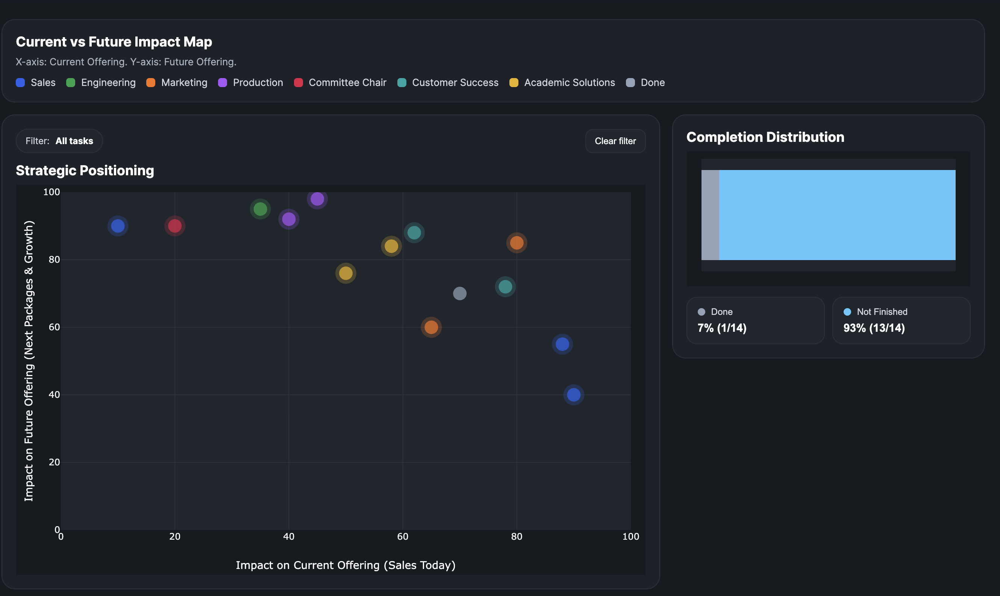
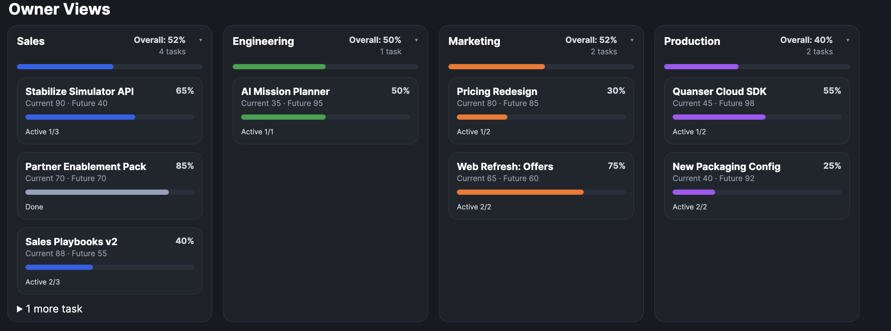

[](https://github.com/sastmo/strategic-task-management/actions/workflows/ci.yml)
[](https://www.python.org/)
[](https://streamlit.io/)
[](https://www.postgresql.org/)
[](https://azure.microsoft.com/en-us/products/container-apps)
[](https://www.docker.com/)
[]()
[]()

# Strategic Task Management

An internal executive alignment dashboard for seeing whether teams are working on the priorities that matter most to current sales and future sales opportunities.

This is intentionally not a task planner. Teams can keep using spreadsheets, notes, Asana, Jira, Linear, Notion, or whatever system already fits their daily work. This app sits above those sources and turns scattered task data into a concise visual signal for senior review.





## Product Fit

The target users are senior and C-level stakeholders who need signal quickly. They usually do not want another workflow tool, another complex dashboard, or a screen that rewards exploration. They need to know:

- Which teams are aligned with today's sales priorities.
- Which teams are investing in future sales opportunities.
- Which important areas are paused, incomplete, or under-owned.
- Where visibility should create follow-up pressure.

The central view is a simple impact matrix. One axis represents impact on the current offering and sales today. The other represents future offering, next packages, and growth. Owner cards add just enough detail to make accountability visible without turning the dashboard into a planning surface.

The minimal interaction model is deliberate. The dashboard is designed for fast executive review, sharing, and embedding in internal channels such as Slack or an internal portal.

## What This Is Not

- It is not a generic to-do app.
- It is not a replacement for planning or execution tools.
- It is not trying to compete with ClickUp, Todoist, Asana, Trello, Linear, or Notion.
- It is not optimized for deep task editing, comments, kanban movement, or personal productivity.

The value is alignment pressure: clear visibility into whether teams are working on the right things.

## Architecture

The app is a small Python service with a separate sync worker and a PostgreSQL warehouse.

```
app.py                  Streamlit entry point
src/domain/             Task model and business rules
src/application/        Auth, settings, sync orchestration, workflow loading
src/infrastructure/     PostgreSQL, Microsoft Graph, source readers
src/presentation/       Dashboard HTML, CSS, JavaScript, auth UI
sql/                    Optional warehouse, mart, and ops SQL views
tests/                  Unit, behavior, security, and integration tests
azure/                  Azure Container Apps deployment template and script
data/                   Local sample source files
assets/                 README screenshots
```

Runtime shape:

- `app`: Streamlit dashboard, reads current task state from PostgreSQL in production.
- `sync`: background worker, ingests source data and writes warehouse snapshots.
- `postgres`: local Docker database; use Azure Database for PostgreSQL in production.

The production app should serve from `DATABASE_URL`/`TASKS_SOURCE` pointing at PostgreSQL. Source ingestion should happen through the sync worker.

## Data Flow

1. Source data comes from CSV, Excel, JSON, Microsoft Graph/SharePoint, or another configured source.
2. The sync worker normalizes rows into a task frame.
3. The worker writes a snapshot into PostgreSQL.
4. The warehouse tracks current state, insertions, updates, deletions, and completion timestamps.
5. The dashboard reads the current warehouse view and displays the executive alignment matrix.

Supported production source pattern:

- Prefer Microsoft Graph/SharePoint or controlled internal files for ingestion.
- Generic HTTP API sources are blocked by default when `ENVIRONMENT=production`.
- The dashboard itself should read from PostgreSQL, not directly from source files.

## Local Development

Copy the example environment file and choose a local-only database password:

```bash
cp .env.example .env
```

Run the full local stack:

```bash
docker compose up --build
```

The dashboard will be available at:

```text
http://localhost:8501
```

For a direct Python run:

```bash
./run.sh
```

Direct Python mode is useful for UI iteration with sample data. Docker Compose is closer to the production shape because it includes PostgreSQL and the sync worker.

## Configuration

Important environment variables:

| Variable | Purpose |
|---|---|
| `ENVIRONMENT` | Set to `production` to enable production safety guards |
| `DATABASE_URL` | PostgreSQL warehouse/auth database URL |
| `TASKS_SOURCE` | Dashboard read source; must be PostgreSQL in production |
| `SYNC_SOURCE_CONFIG` | Source config used by the sync worker |
| `AUTH_MODE` | `local`, `app_service`, or `disabled` |
| `AUTH_USE_DATABASE_ROLES` | Uses database-backed app roles when true |
| `AUTH_REQUIRE_EXPLICIT_ACCESS` | Prevents default access grants when true |
| `APP_TRUSTED_PROXY_SECRET` | Shared proxy secret required for production App Service auth |
| `GRAPH_TENANT_ID` | Microsoft Graph tenant ID |
| `GRAPH_CLIENT_ID` | Microsoft Graph app/client ID |
| `GRAPH_CLIENT_SECRET` | Microsoft Graph client secret, stored outside git |
| `DB_BOOTSTRAP_SCHEMA` | Allows first-run schema initialization when true |

Production startup fails safely when:

- `AUTH_MODE=local` or `AUTH_MODE=disabled` is used with `ENVIRONMENT=production`.
- `AUTH_ALLOW_UNVERIFIED_APP_SERVICE_PROXY=1` is used in production.
- `AUTH_MODE=app_service` is used in production without `APP_TRUSTED_PROXY_SECRET`.
- `DATABASE_URL` is missing in production.
- `TASKS_SOURCE` is not a PostgreSQL URL in production.

## Authentication And Authorization

Local development uses `AUTH_MODE=local`.

Production should use:

```env
ENVIRONMENT=production
AUTH_MODE=app_service
AUTH_REQUIRED=true
AUTH_REQUIRE_EXPLICIT_ACCESS=true
AUTH_DEFAULT_ROLE=
AUTH_USE_DATABASE_ROLES=true
AUTH_AUDIT_TO_DATABASE=true
APP_TRUSTED_PROXY_SECRET=<stored outside git>
```

Azure handles sign-in. The app then reads the Azure identity headers, validates the expected trusted proxy secret, checks tenant/group/database roles, and records lightweight audit events.

For a maximum internal audience of roughly 50 users, use Azure AD groups or database role assignments to keep access explicit.

## Azure Deployment

The repository includes an Azure Container Apps template and deployment script:

```text
azure/container-apps.bicep
azure/deploy.sh
azure/parameters.example.json
```

Production assumptions:

- Azure Container Apps or App Service style authentication in front of Streamlit.
- Azure Database for PostgreSQL as the warehouse/auth database.
- Azure Key Vault references for database URL, proxy secret, and Graph secret.
- Microsoft Graph/SharePoint as the preferred source adapter for spreadsheet-based executive workflows.
- HTTPS-only ingress.

First deployment:

1. Copy `azure/parameters.example.json` to `azure/parameters.json`.
2. Replace placeholders with your tenant, registry, Key Vault, group IDs, and source config.
3. Set `bootstrapSchema` to `true` only for the first initialization run.
4. Deploy with `./azure/deploy.sh --resource-group <rg> --registry <registry>.azurecr.io --env-name <name>`.
5. Confirm the sync worker records a successful run.
6. Set `bootstrapSchema` back to `false` and redeploy.

Detailed Azure notes live in [docs/production.md](docs/production.md).

## Database

The database layer uses PostgreSQL with a small connection pool. The schema includes:

- `ops.ingestion_runs` for sync status and freshness.
- `staging.task_records` and `staging.task_snapshots` for raw normalized inputs.
- `warehouse.tasks_current` for dashboard reads.
- `warehouse.task_history` for change tracking.
- `app.users`, `app.user_role_assignments`, and audit tables for authorization and activity.

Schema creation is explicit. Use `DB_BOOTSTRAP_SCHEMA=true` only for local development or first production initialization.

Optional SQL views in `sql/` provide analyst-facing portfolio, owner scorecard, and sync-health views.

## Security Posture

Production hardening in this repo focuses on the risks that matter for a small internal executive app:

- Production auth fails closed for unsafe modes.
- Database-backed role lookup failures deny access when DB roles are required.
- Generic HTTP API task sources are blocked by default in production.
- Local file sources are restricted by `TASK_SOURCE_ROOT`.
- Dashboard JSON is escaped before being embedded into HTML.
- Graph secrets and database URLs are represented as placeholders/examples only.
- Local `.env`, Azure parameter files, caches, logs, and assistant metadata are ignored.

Manual production responsibilities:

- Store real secrets in Azure Key Vault or Azure App Settings.
- Restrict Azure authentication to the intended tenant and groups.
- Assign the app/sync identity only the Graph and database permissions it needs.
- Rotate secrets if any real value was ever copied into local files or chat.
- Enable branch protection and required CI checks before production changes merge.

## Testing

Run the main checks:

```bash
ruff check .
mypy
python -m unittest discover -s tests -v
```

Run coverage the same way CI does:

```bash
pytest tests/ -v --tb=short --cov=src --cov-report=xml --cov-report=term-missing --cov-fail-under=70
```

Optional PostgreSQL integration tests:

```bash
TEST_DATABASE_URL=postgresql://... python -m unittest tests.test_task_store_integration -v
```

CI runs Ruff, mypy, source compilation, tests with coverage, coverage artifact upload, and Docker Compose config validation.

## Repository Hygiene

Tracked files should be source, tests, docs, SQL assets, sample data, screenshots, Docker/Azure config, and examples.

Ignored files include local `.env` files, Azure `parameters.json`, virtual environments, caches, coverage output, logs, local databases, IDE metadata, OS files, and local assistant tooling such as `.claude/` and `.codex/`.

Do not commit real secrets, local database dumps, generated caches, or agent-specific metadata.
